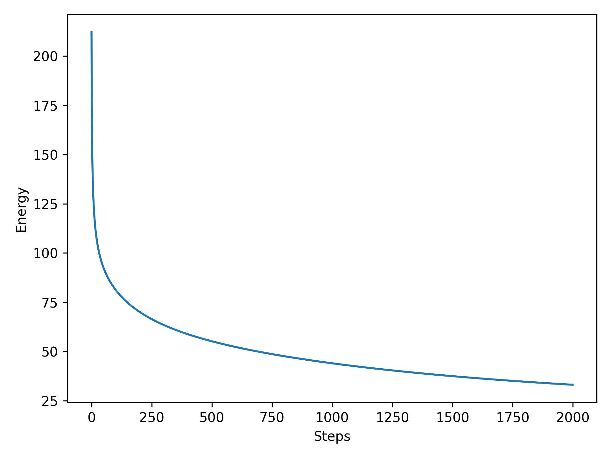
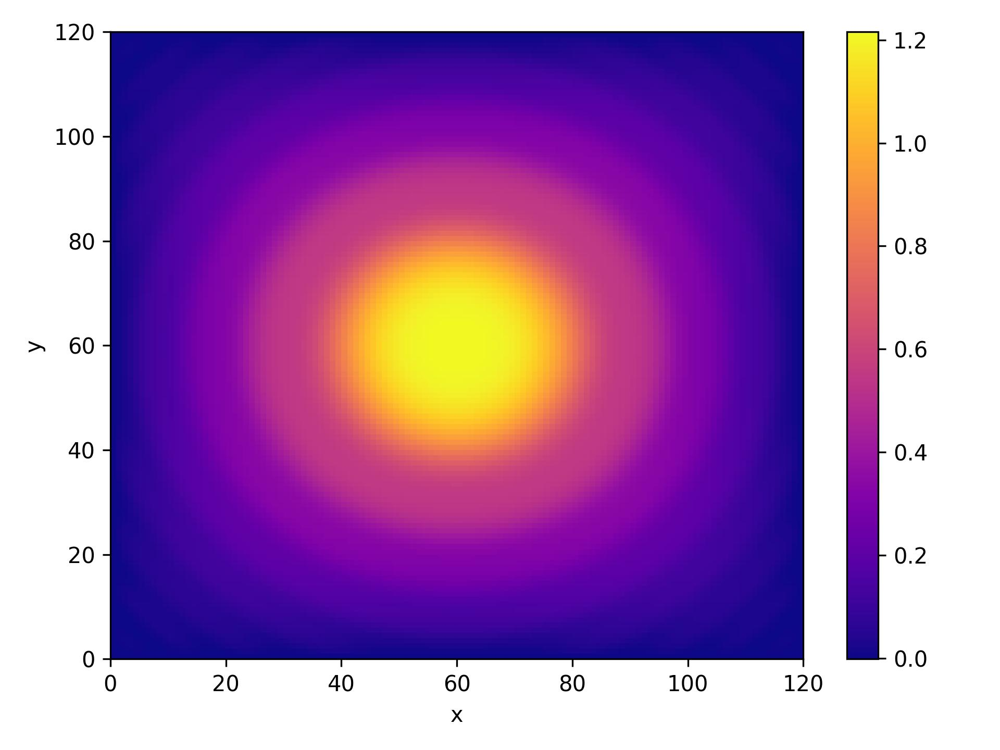
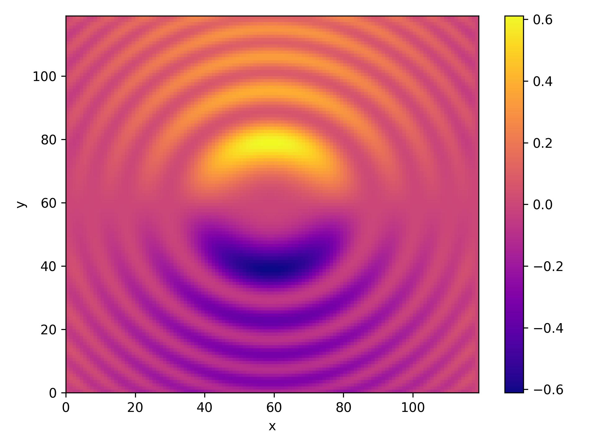

# Computational Physics: Solving the Poisson Equation in 1D & 2D

Iasonas Andronis - ph4783 (UOC Department of Physics) 

  

## Introduction

The [poisson equation](https://en.wikipedia.org/wiki/Poisson%27s_equation) is a famous PDE that is used to derive solutions to various physical problems. One such problem is deriving the charge potential and electric field of a system, given some initial and boundary conditions and a source charge distribution. All of the units of the variables of the problems presented below are dimensionless.

## 1D Problem

A simple problem that can be solved with the poisson equation is finding the electric potential on a 1 dimensional rod that is insulated on each end. The definition of this problem is:

<!-- $$
-\frac{d^2\phi(x)}{dx^2} = S(x)\; ,
\\\;
\\
\phi(0)=\phi(1)=0\; ,
\\\;
\\
S(x) = 12x^2
$$ --> 

with <!-- $\phi(x)$ -->  being a real valued function representing the electric potential and <!-- $S(x)$ -->  being the source charge distribution. The solution of this problem is provided from the course notes and is <!-- $\phi(x)=x(1-x^3)$ -->  and the energy of the system should asymptotically converge to the value <!-- $E=-0.64286$ --> . We can see the numerical solution in the figures below, along with the analytical solution provided.

<b>Figure 1 - </b> Left: Energy of the system as a function of the timesteps. Right: Electric Potential as a function of x. The red dashed lines corresponds to the analytical result provided in the notes.

<b>Figure 2 - </b> The electric Field produced by the final charge distribution.

<b>Figure 4 - </b> The initial charge distribution on the rod.

  

The electric potential & field that are shown represent their respective quantities after 10000 repetitions. As we can surmise the numerical solution is producing satisfactory results.
  

## 2D Problem

The poisson equation presented in the previous section is a special case of the generalized equation:

<!-- $$
\nabla^2 \phi(x,y) = S(x,y)
$$ --> 

where <!-- $\nabla^2$ -->  is the laplacian. We can define a source distribution:

<!-- $$
S(x,y) = sin(x^2+y^2)
$$ --> 

which we can see in . The boundary conditions are, for a cartesian domain <!-- $\Omega$ -->  where <!-- $\Omega\subset\R^2$ --> , <!-- $\phi(x,y)=0$ -->  on <!-- $\partial\Omega$ --> , where <!-- $\partial\Omega$ -->  is the boundary of <!-- $\Omega$ --> . The resulting numerical solution is presented in the figures below.

<b>Figure 5 - </b> Energy of the system as a function of the timesteps. It assymptotically converges to the value 33.0973.

<b>Figure 6 - </b> Stream lines of the electric Field produced by the final charge distribution.

<b>Figure 7 - </b> The electric potential after 10000 timesteps.

<b>Figure 8 - </b> The x component of the electric field after 10000 timesteps.

<b>Figure 9- </b> The x component of the electric field after 10000 timesteps.

<b>Figure 10 - </b> The source charge distribution.

