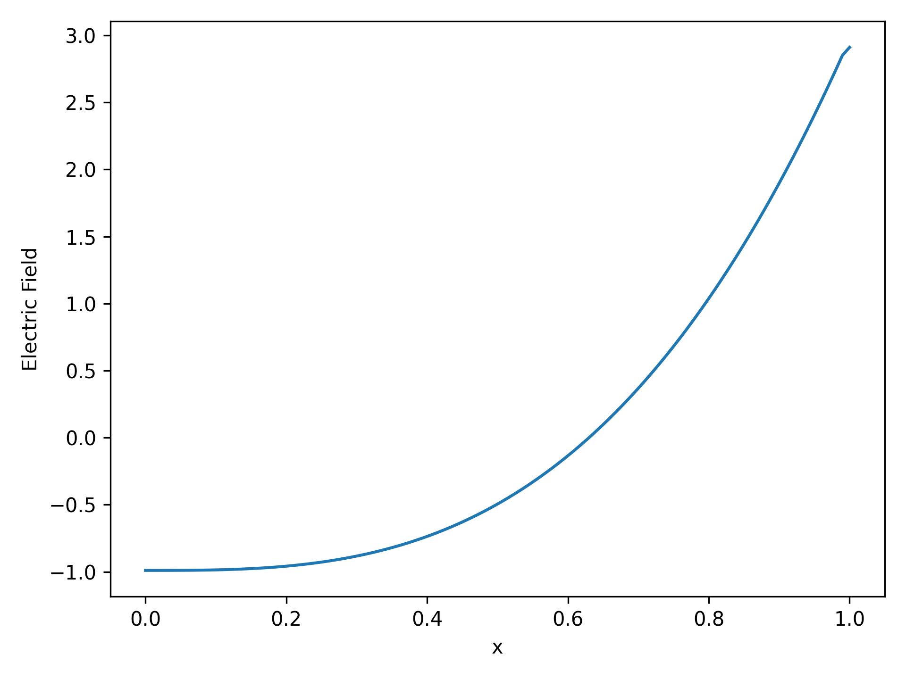
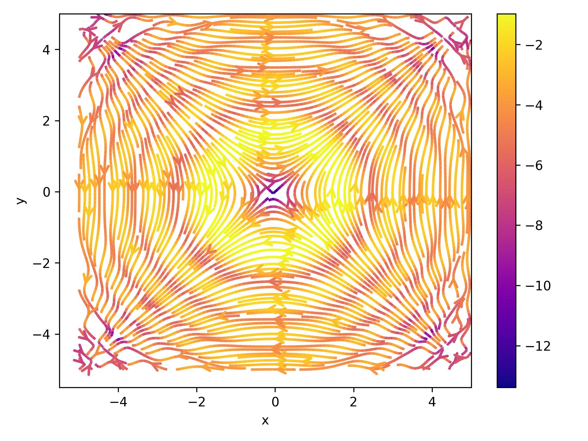
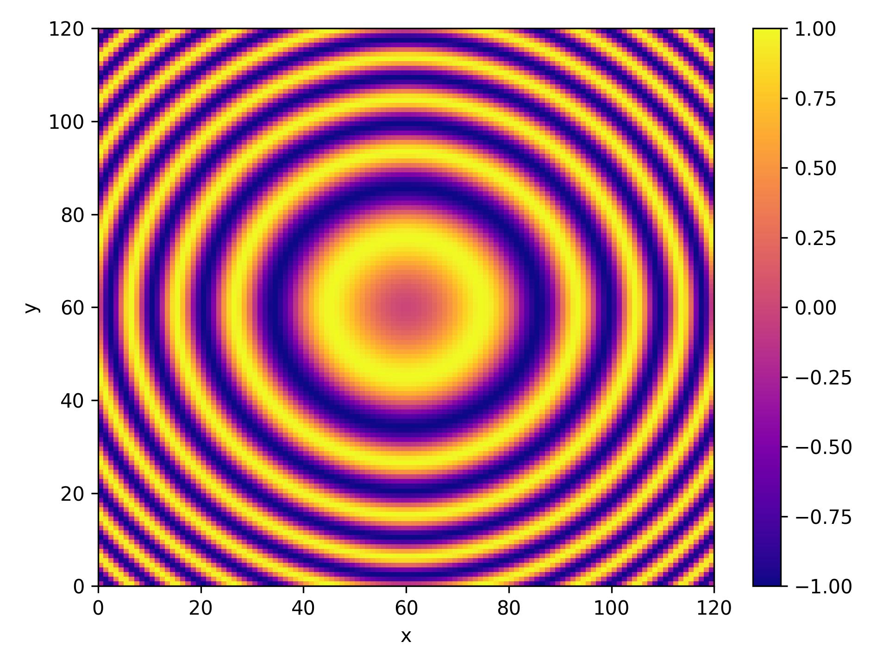

# Computational Physics: Solving the Poisson Equation in 1D & 2D

## Introduction

The [poisson equation](https://en.wikipedia.org/wiki/Poisson%27s_equation) is a famous PDE that is used to derive solutions to various physical problems. One such problem is deriving the charge potential and electric field of a system, given some initial and boundary conditions and a source charge distribution. All of the units of the variables of the problems presented below are dimensionless.

## 1D Problem

A simple problem that can be solved with the poisson equation is finding the electric potential on a 1 dimensional rod that is insulated on each end. The definition of this problem is:

$$
-\frac{d^2\phi(x)}{dx^2} = S(x)\; ,
\\\;
\\
\phi(0)=\phi(1)=0\; ,
\\\;
\\
S(x) = 12x^2
$$

with $\phi(x)$ being a real valued function representing the electric potential and $S(x)$ being the source charge distribution. The solution of this problem is provided from the course notes and is $\phi(x)=x(1-x^3)$ and the energy of the system should asymptotically converge to the value $E=-0.64286$. We can see the numerical solution in the figures below, along with the analytical solution provided.

<b>Figure 1 - </b> Left: Energy of the system as a function of the timesteps. Right: Electric Potential as a function of $x$. The red dashed lines corresponds to the analytical result provided in the notes.

<b>Figure 2 - </b> The electric Field produced by the final charge distribution.

<b>Figure 4 - </b> The initial charge distribution on the rod.

The electric potential & field that are shown represent their respective quantities after 10000 repetitions. As we can surmise the numerical solution is producing satisfactory results.

## 2D Problem

The poisson equation presented in the previous section is a special case of the generalized equation:

$$
\nabla^2 \phi(x,y) = S(x,y)
$$

where $\nabla^2$ is the laplacian. We can define a source distribution:

$$
S(x,y) = sin(x^2+y^2)
$$

which we can see in . The boundary conditions are, for a cartesian domain $\Omega$ where $\Omega\subset\R^2$, $\phi(x,y)=0$ on $\partial\Omega$, where $\partial\Omega$ is the boundary of $\Omega$. The resulting numerical solution is presented in the figures below.

<b>Figure 5 - </b> Energy of the system as a function of the timesteps. It assymptotically converges to the value 33.0973.

<b>Figure 6 - </b> Stream lines of the electric Field produced by the final charge distribution.

<b>Figure 7 - </b> The electric potential after 10000 timesteps.

<b>Figure 8 - </b> The x component of the electric field after 10000 timesteps.

<b>Figure 9- </b> The x component of the electric field after 10000 timesteps.

<b>Figure 10 - </b> The source charge distribution.

