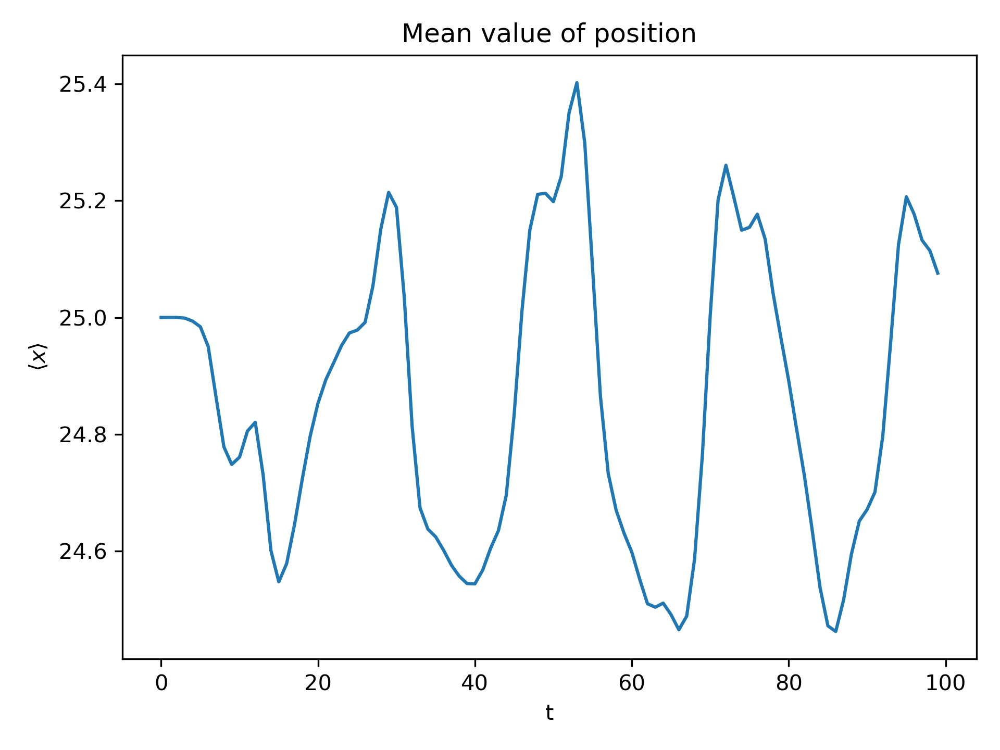

# Computational Physics: Exact Diagonalization

Iasonas Andronis - ph4783 (UOC Department of Physics) 

  

## Introduction

Exact Diagonalization is a numerical method that is widely used for solving problems in quantum mechanics. In essense a Hamiltonian matrix is constructed and then diagonalized to find the eigenstates and eigenenergies so any observable can be then calculated from those.

## Construction of the Hamiltonian

The Hamiltonian used in this problem is known as the Tight Binding Hamiltonian for a single electron in a 1d Lattice. Periodic Boundary conditions are assumed. The Hamiltonian is of the form:

<!-- $$
H = \lambda \sum_n \left(| n+1 \rangle \langle n | + | n  \rangle\langle n+1 |\right) + V_{nn}\sum_n | n \rangle \langle n |
$$ --> 

where <!-- $\lambda$ -->  is the hopping term between lattice sites and <!-- $V_{nn}$ -->  are the diagonal elements of a diagonal potential matrix. The <!-- $i,j$ --> -th element of the hamiltonian is calculated like so:

<!-- $$
\langle i | H | j \rangle = \langle i | \left( \lambda \sum_n \left(| n+1 \rangle \langle n | + | n  \rangle\langle n+1 |\right) + V_{nn}\sum_n | n \rangle \langle n | \right) | j \rangle
$$ -->

<!-- $$
= \langle i | \left( \lambda \sum_n \left(| n+1 \rangle \langle n | j \rangle + | n  \rangle\langle n+1 | j \rangle\right) + V_{nn}\sum_n | n \rangle \langle n | j \rangle\right)
$$ -->
&nbsp;

<!-- $$
= \lambda\langle i | j+1 \rangle + \lambda\langle i | j-1 \rangle +V_{nn}\langle i | j \rangle
$$ -->
&nbsp;

&nbsp;
<!-- $$
= \lambda\delta_{i,j+1} + \lambda\delta_{i,j-1} + V_{nn}\delta_{i,j}
$$ -->

where <!-- $\delta_{n,m}$ -->  is the Kronecker delta. We used a step potential.

<b>Figure 1 - </b> Plot of the diagonal elements of the potential matrix.

The initial Gaussian distribution of the wave packet is:

<!-- $$
C(i) = e^{(-0.04(x-25)^2)}
$$ --> 

Now that we have a matrix (which we already can see that it is tridiagonal) we can compute numerically its eigestates and eigenenergies using functions from the Header Library [Eigen](https://eigen.tuxfamily.org/index.php?title=Main_Page) or any other way we want. An example observable that we can calculate is the position <!-- $x$ --> .

<b>Figure 2 - </b> Time evolution of the probability density of the electron.

<b>Figure 3 - </b> Mean value of position with respect to time.

<b>Figure 4 - </b> Position uncertainty with respect to time.

