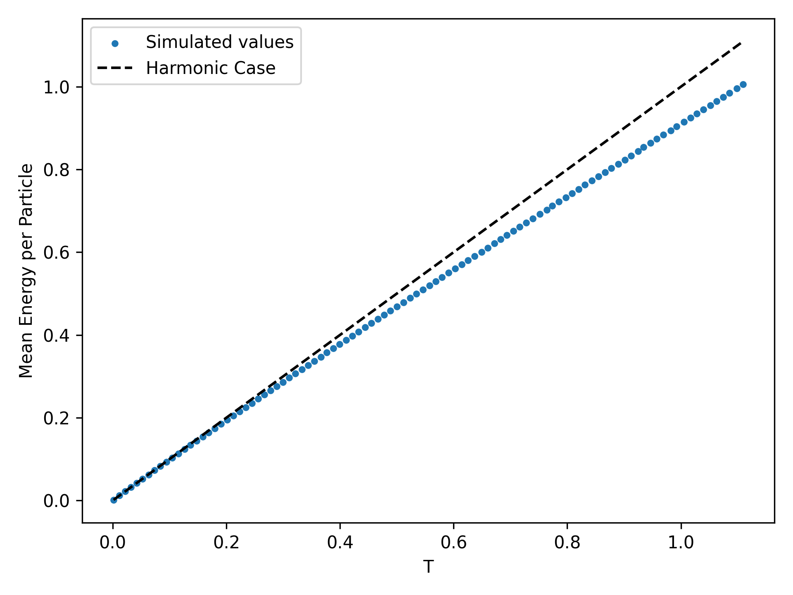

# Computational Physics: Molecular Dynamics

Iasonas Andronis - ph4783 (UOC Department of Physics) 

  

## Introduction

Molecular Dynamics is a computational method for simulating the complex dynamics between molecules in lattices. Under MD we assume that particles behave according to Newtonian mechanics (although Hamiltonian mechanics can be used). It is usually applied in the examination of thermodynamic variables.

## Method

In this section we will shortly examine the iterative process that is MD. The algorithm requires user defined values for the initial position <!-- $q$ -->  and velocity <!-- $V$ -->  of each particle. We set the first one 0 for all particles and we sample from a uniform distribution within a predefined range for the second one.

<b>Figure 1 - </b> Process Diagram of MD.

To update our parameters we utilize Verlet's Algorithm
<!-- $$
\begin{equation}
    q_{i}(t) = q_{i}(t-\delta t) + v_{i}(t-\delta t)\delta t + \frac{1}{2}a[q_{i}(t-\delta t)]\delta t^2
\end{equation}
$$ -->

<!-- $$
\begin{equation}
    v_{i} = v_{i}(t-\delta t) + a[q_{i}]\delta t
\end{equation}
$$ -->

where <!-- $a$ -->  is the acceleration of each particle <!-- $i$ --> .

## Heat Capacity

In this project we will utilize MD to calculate the heat capacity of a system. The heat capacity is defined as the proportionality constant between the mean total energy and the temperature. The system can be modeled using this Hamiltonian
<!-- $$
H = \underbrace{\frac{1}{2}\sum_{i} m_i v_i^2}_{E_k} + \underbrace{\frac{1}{2}k\sum_i(q_{i+1}-q_i)^2 + \frac{1}{4}g\sum_i(q_{i+1}-q_i)^4 + \frac{1}{2}\alpha\sum_i q_i^2 + \frac{1}{4}b\sum_i q_i^4}_{U}
$$ -->

where <!-- $E_k$ -->  is the kinetic energy and <!-- $U$ -->  is the potential energy. We use the values of <!-- $q_i$ -->  and <!-- $v_i$ -->  that we calculated before to compute the total energy. We evolve the system for an arbitary time max_t as one can see in Figure 2. We can now compute the mean of the total energy, and divide it with the total number of particles to find the mean energy per particle. From this we can plot it against the simulated temperature for the calculated kinetic energy, as we can see in Figure 3.

<b>Figure 2 - </b> Plots of the kinetic, potential and total energy of the system. The plots are (a) left, displays the kinetic and potential energies with their respective rolling means with window 20 (b) right, displays the total energy of the system with respect to time.

<b>Figure 3 - </b> Plot of MEPP with respect to the simulated temperature. Parameters are k=3, b=7, α=2, g=5.

