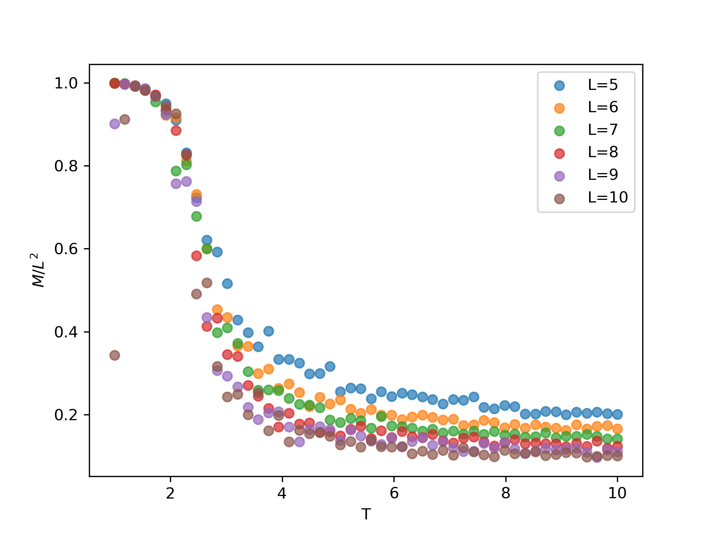
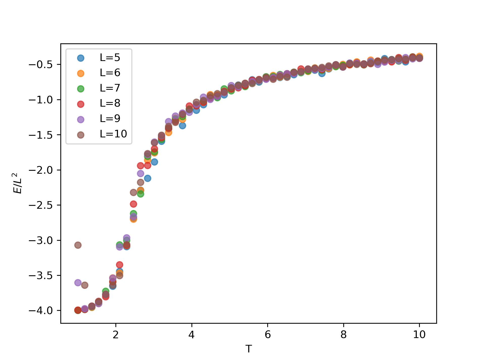
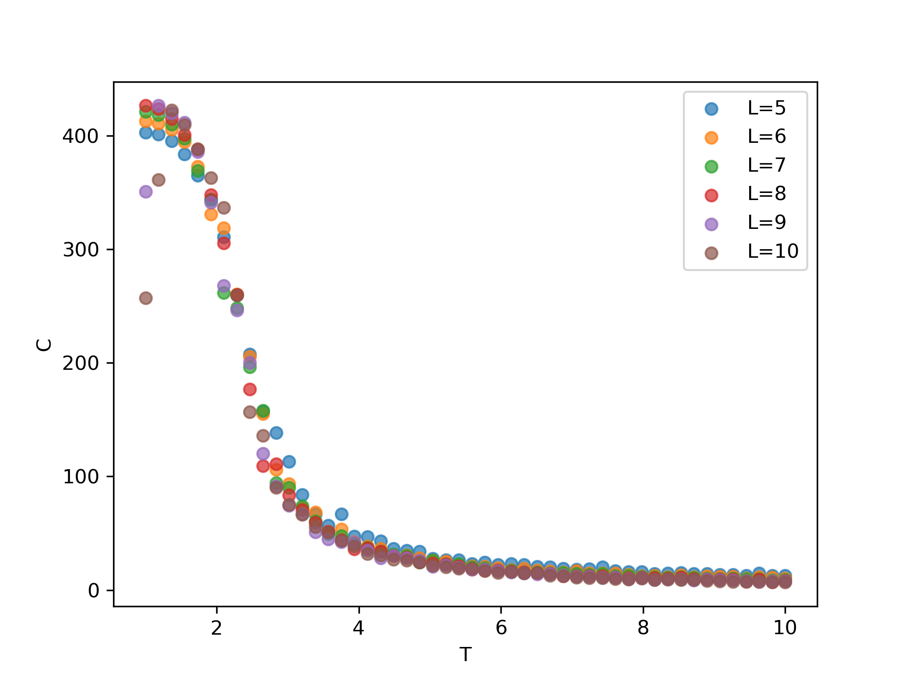
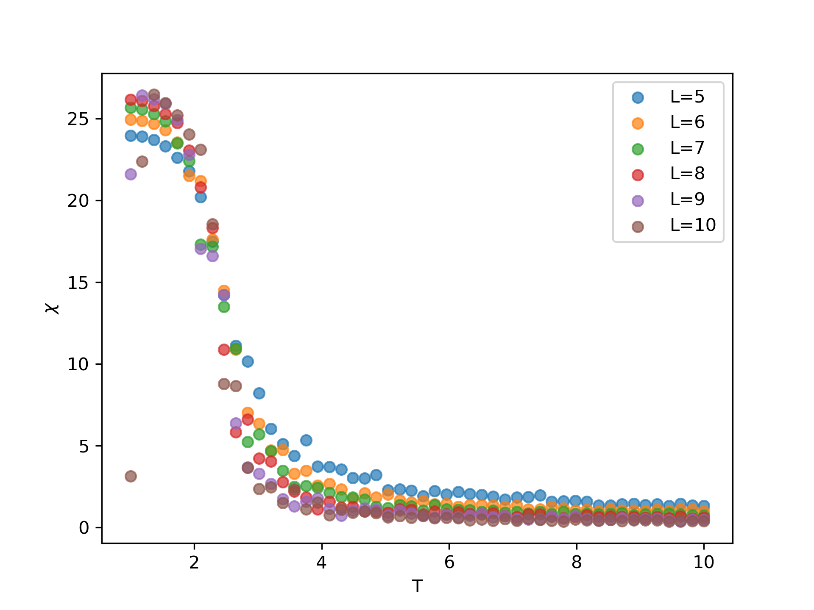

# Computational Physics: Monte Carlo

Iasonas Andronis - ph4783 (UOC Department of Physics) 

  

## Introduction

Monte Carlo methods are a class of computational methods defined by random sampling with the aim of calculating some value or integral. In this project we made use of the Metropolis Monte Carlo method with the aim to integrate a 2D Ising model and calculate physical quantities like Magnetization or specific heat capacity.

## Metropolis Monte Carlo

The Metropolis Monte Carlo method (MMC) is a robust method of integrating a classical 2D ising model by randomly selecting and flipping spin quantum numbers on a lattice using a physics based random condition. The hamiltonian of the problem is

<!-- $$
H = -J\sum_{\langle i,j \rangle} \sigma_i \sigma_j - B\sum_i \sigma_i
$$ --> 

where <!-- $J$ -->  represents the strength of the interaction of neighbouring spins and <!-- $B$ -->  is the magnitude of the magnetic field. We impose periodic boundary conditions. We used the MMC algorithm to measure specifically the Energy, the Magnetization, the specific heat capacity and the magnetic susceptibility of the lattice, for different values of the lattice size <!-- $L$ -->  and temperature <!-- $T$ --> . To achieve this the main program does the following:

1. Select a lattice size.
2. Initialize the spin matrix representing the spin values for all lattice sites.
3. Advance the lattice state N times using MMC, and measure the mean values of our physical variables for various temperatures.
4. Repeat from 1.

Our results can be seen in the following figures.

<b>Figure 1 - </b> Plot of the Magnetization versus the Temperature of various lattice sizes.

<b>Figure 2 - </b> Plot of the Energy versus the Temperature of various lattice sizes.

<b>Figure 3 - </b> Plot of the Specific Heat Capacity versus the Temperature of various lattice sizes.

<b>Figure 4 - </b> Plot of the Magnetic Susceptibility versus the Temperature of various lattice sizes.

